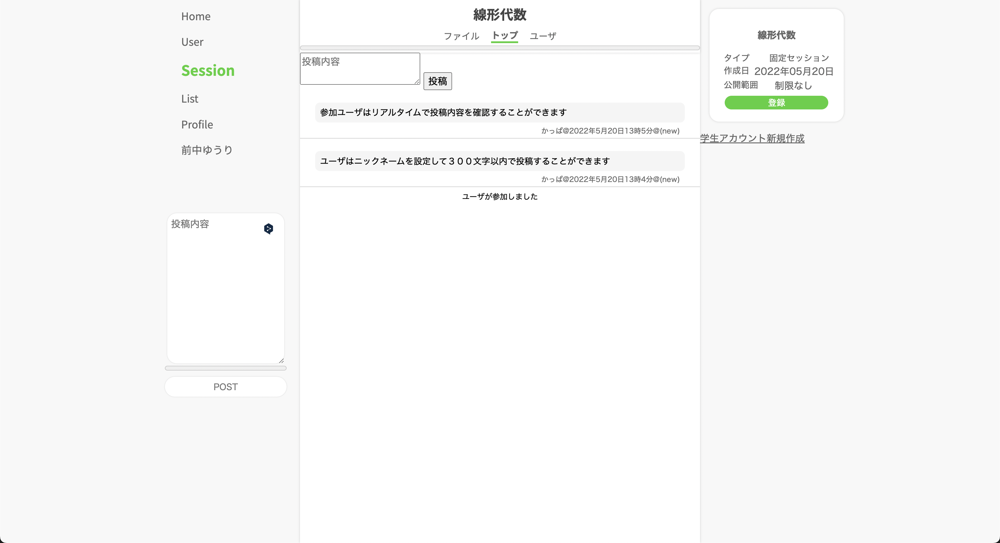
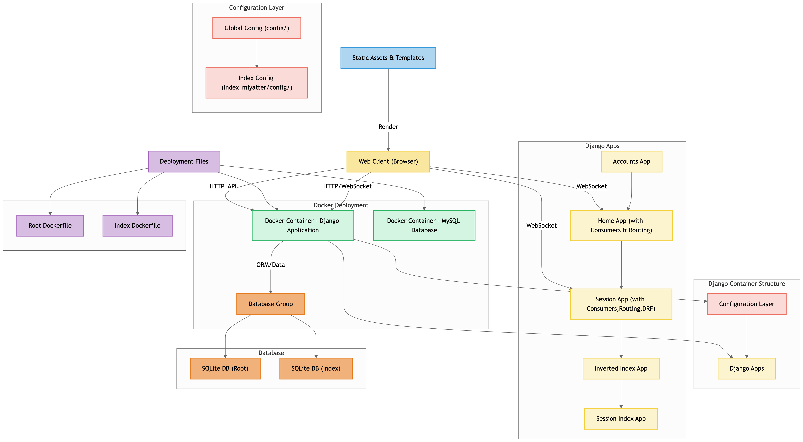

<h1>Miyatter</h1>
Miyatterは、Django REST Framework（DRF）とDjango Channelsを利用して開発した、Twitterと2chを融合させたようなリアルタイムWebコミュニケーションアプリです。 
投稿内容は全て非同期で接続しているユーザに即時配信され、最新の情報がリアルタイムに反映されます。

  

 
 

<h2>アーキテクチャ図</h2>

<h2>採用技術</h2>
<ul>
  <li><strong>言語 :</strong> Python</li>
  <li><strong>フレームワーク :</strong>
    <ul>
    <li>Django</li>
    <li>Django REST Framework(DRF)</li>
    </ul>
  </li>
  <li><strong>Django拡張ライブラリ :</strong> Django Channels</li>
  <li><strong>フロントエンド :</strong> HTML, CSS, JavaScript</li>
  <li><strong>データベース :</strong> MySQL</li>
  <li><strong>インフラ :</strong> Docker, Docker Compose</li>
</ul>
